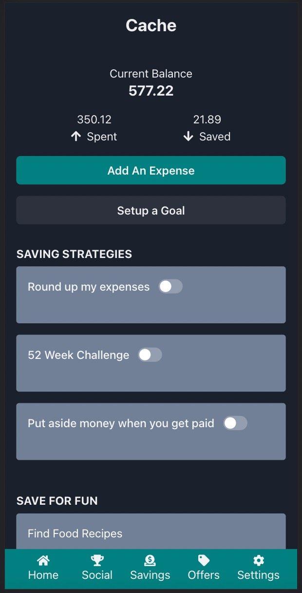
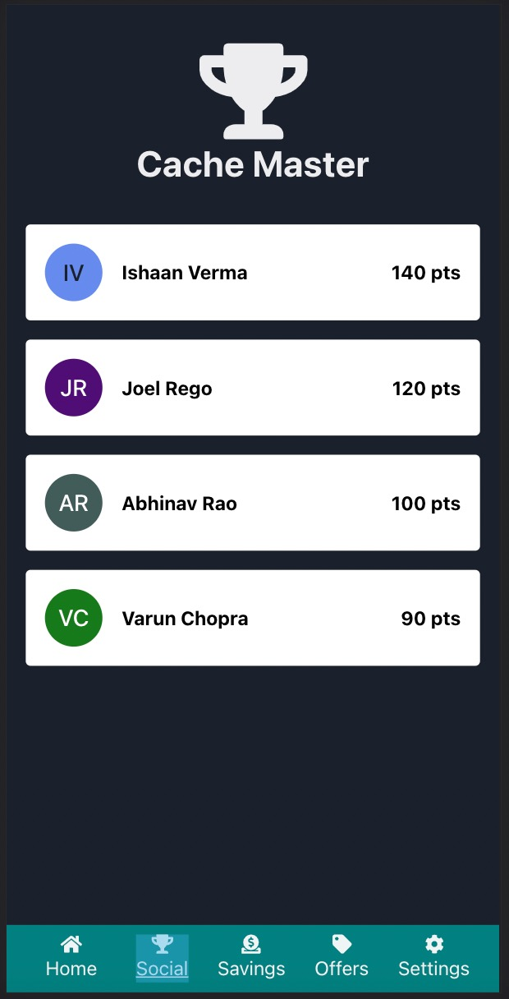
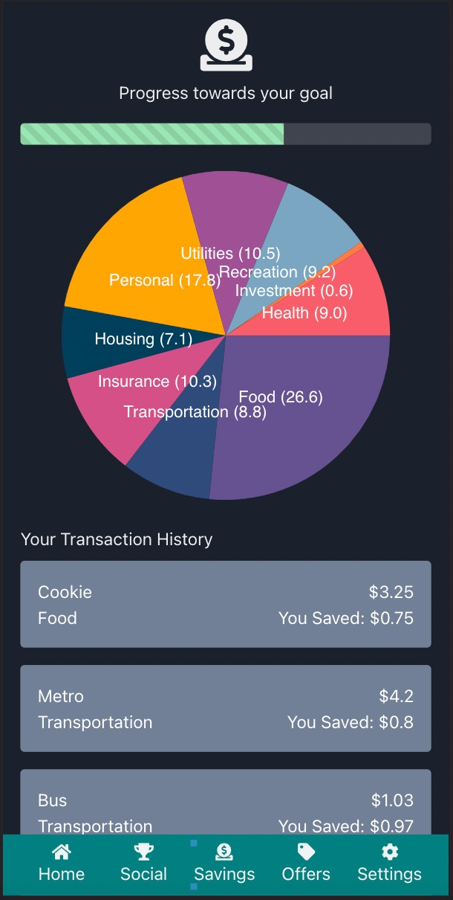
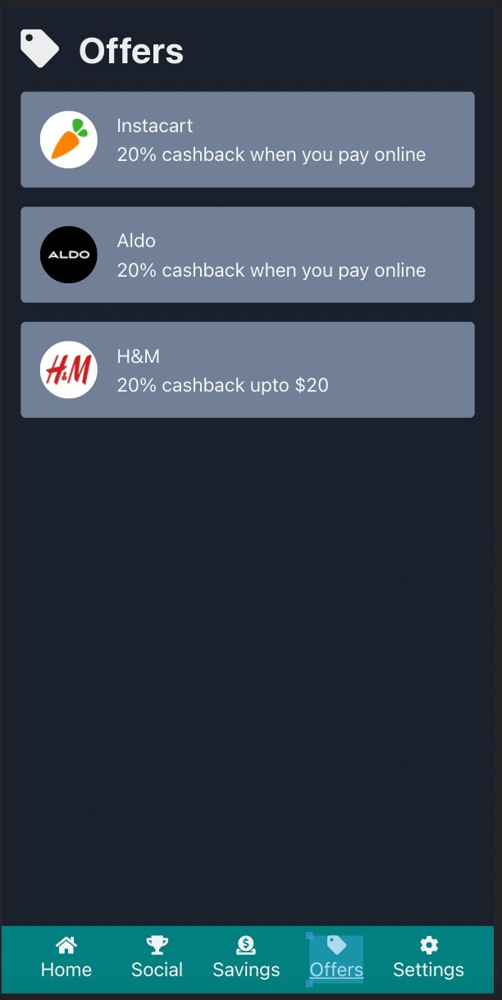
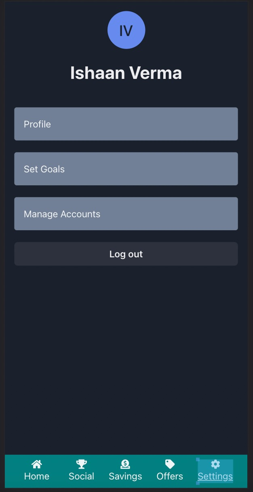

# PennApps Hackathon

## What it does
Cache provides users with multiple saving strategies based on their predefined goals. We reward them for reaching those goals with offers and discounts that match the category of spending for which they plan to save money. The app keeps track of their overall expenditures and automatically classifies spending into different categories. It also maps the amount saved in each category towards their goals. If the user ends up spending more in any of the pre-defined spending categories (essential & non-essential) then we suggest methods to reduce spending. Moreover, the app provides relevant and rewarding offers to users based on the timely meeting of their set goals. The offers may contain access to additional airline mileage points, cash back offers and other discount coupons to name a few.

## Screenshots

